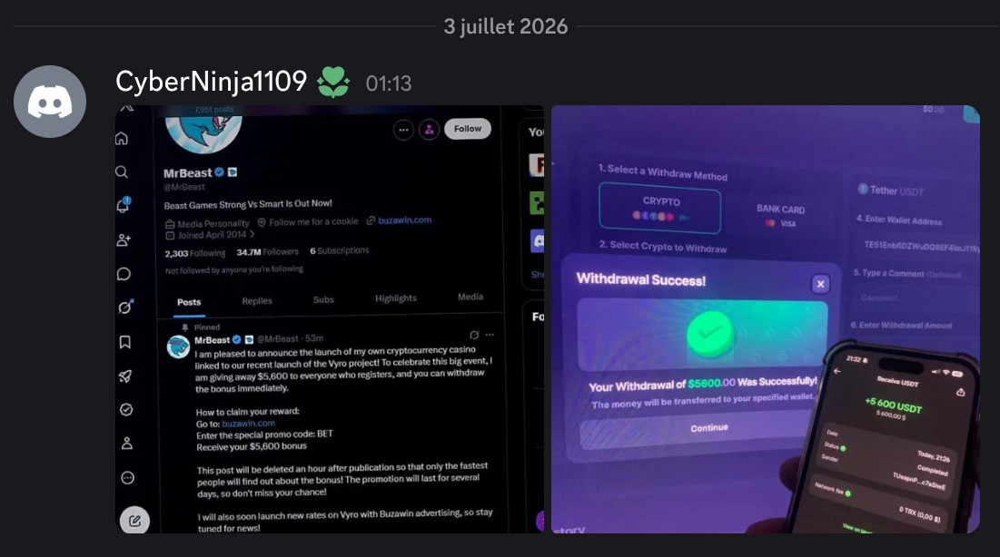
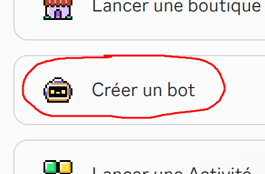
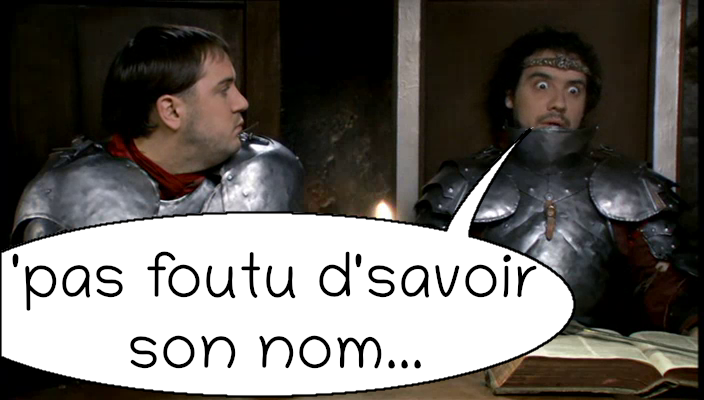

# discord-spam-scanner

Un bot Discord pour détecter le spam.

## Description

Holà ! C'est du **spam**, ça ! Vous croyez que je le vois pas ? Vous me prenez pour un imbécile ou quoi ? Et pourquoi le **!bot** de monsieur **Grafrikart** ne fait rien ? C'est dur de coder l'anti-spam ou pas ? Essayons...

## Création du bot

1. Va sur... excuse-moi de te tutoyer, va sur : <https://discord.com/developers/applications>.
2. Si tu n'es pas authentifié sur le site de Discord, il faut t'authentifier avec le compte avec lequel tu comptes créer le bot.
3. Si c'est la première fois que tu vas là-bas, ils vont te demander si tu veux détruire le monde et tuer tous les humains. Tu réponds que "*non*", tu veux juste créer un bot :

4. Clique sur le bouton "**Nouvelle application**".
5. Donne-lui un nom, par exemple : "**SpamScanner**".
6. Une fois le bot créé, utilise la barre latérale gauche pour aller dans la section "**Bot**".
7. Scrolle vers le bas et coche la case "**Message Content Intent**", sinon, le bot n'aura pas le droit de lire les messages.
8. Scrolle vers le haut et clique sur le bouton "**Réinitialiser le token**".
9. Copie le token, et conserve-le précieusement dans ton coffre-fort. C'est le code pour tirer les missiles sur les États-Unis.
10. Utilise la barre latérale gauche pour aller dans la section "**OAuth2**".
11. Dans "**Générateur d'URL OAuth2**", coche :
    - `bot`
12. Deux blocs supplémentaires vont apparaître pour te rendre fou :
    - Permissions du bot
    - Type d'intégration
13. Dans "**Permissions du bot**", coche :
    - Voir les salons
    - Voir les anciens messages
14. Copie l'URL générée, et ouvre-la dans un nouvel onglet. Tu vas pouvoir ajouter le bot à ton serveur Discord.

*... (à compléter)*

## Grafrikart

Si je dis "**Grafrikart**" au lieu de "**Grafikart**", c'est parce que dans l'une de ses vidéos, il dit "**Grafrikart**", et comme je suis un gros moqueur, je n'arrive pas à me le sortir de la tête... Je ne sais plus dans quelle vidéo il dit ça, c'était vers la fin d'une vidéo, j'ai peut-être fait une vanne en commentaire à ce sujet... Celui qui trouve de quelle vidéo il s'agit marque **cinquante points** !

## Lien vers le chef-d'œuvre

<https://github.com/luc2/discord-spam-scanner>
